# PIP — a personal work operating system

A local-first dashboard that aggregates work from every system Key actually
works in, and keeps a durable record of what happened. Styled as a pixelated,
LED-lit device screen.

The underlying idea: treat **monday.com and Azure DevOps as datasources, not
as the interface**. They stay the system of record; the surface you actually
work in is this one.

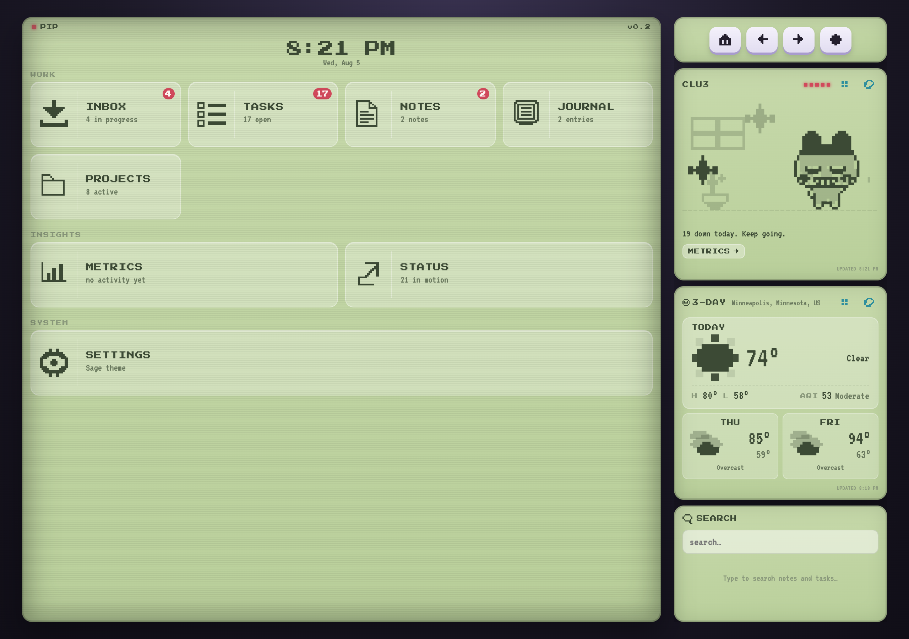

**[Live read-only snapshot →](https://pip-workspace-snapshot.netlify.app)**
A static, point-in-time copy of the real workspace. Everything works —
including search — but nothing saves, and it says so at the top.

It's a real full-stack app — Express + better-sqlite3 on the backend, a
webpack-bundled frontend talking to it over `fetch()` and Server-Sent Events.
It replaced an earlier static/`file://`-only version specifically so Claude
could get direct, live access to the data.

If you're working on this with Claude Code, it reads `CLAUDE.md` automatically
— commands, architecture, conventions, and how it should interact with the
running app all live there. This README is the human-facing tour.

---

## Running it

```bash
npm install       # once — better-sqlite3 is a native addon
npm run server    # http://127.0.0.1:4288
```

Then either bookmark it, or install the LaunchAgent so it's always up:

```bash
cp scripts/com.folklore.pip.plist ~/Library/LaunchAgents/
launchctl load ~/Library/LaunchAgents/com.folklore.pip.plist
```

Frontend changes need `npm run build` (or `npm run watch`).

---

## The five entities

The distinction between them is the whole point.

| Entity | What belongs here | Lifecycle |
|---|---|---|
| **Inbox** | Anything needing triage | new → active → resolved → archived |
| **Tasks** | Concrete work with a definition of done | open → doing → done |
| **Notes** | Reference material, disconnected blurbs | none |
| **Journal** | A dated work log, written as the day goes | none — read in sequence |
| **Projects** | What everything else can belong to | open / closed |

If you're unsure between Notes and Journal: a **note** is something you'll go
looking for later; a **journal entry** is something you'll read in order.

### Tasks

Grouped the way you actually read a board — in progress, then queued, then
history. Done collapses by default because it's the biggest group and the
least actionable. Synced tickets lead with their number, linked back upstream.

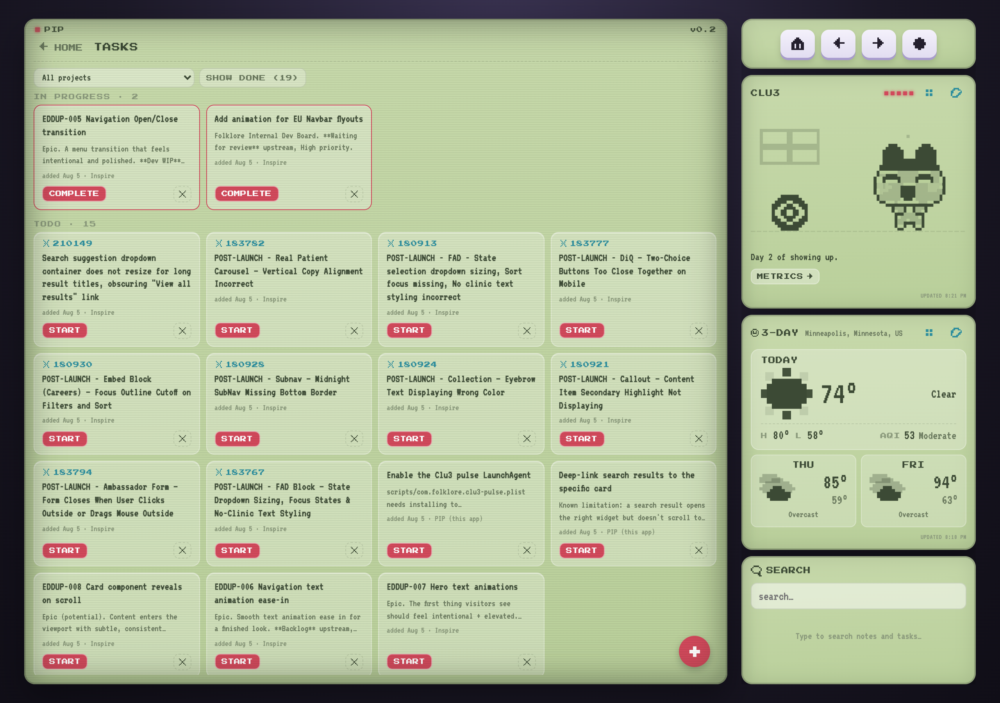

Clicking a card opens the full ticket: upstream description, acceptance
criteria, metadata, images and links.

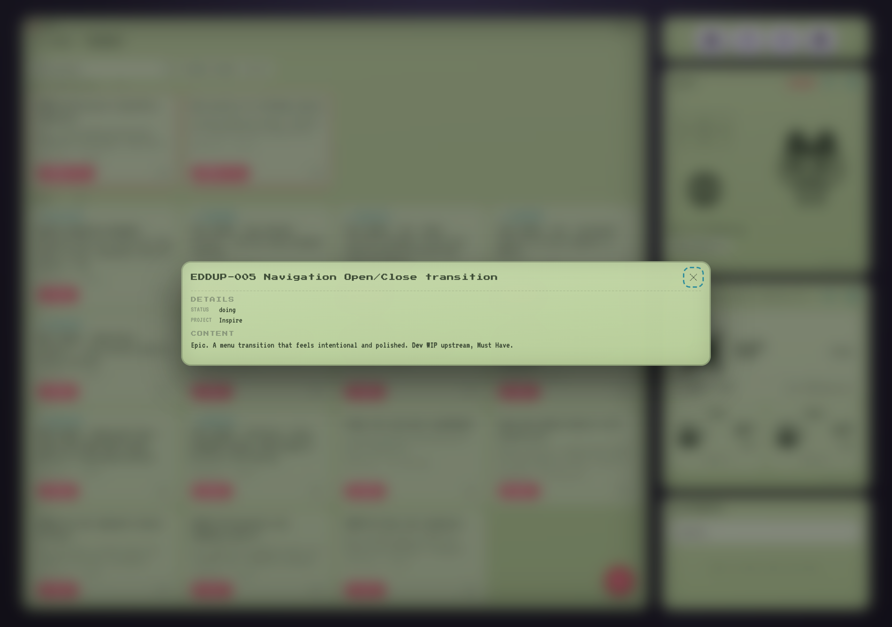

### Notes and Journal

Notes are cards with a clamped preview and a detail modal — they're
disconnected things you scan for one item.

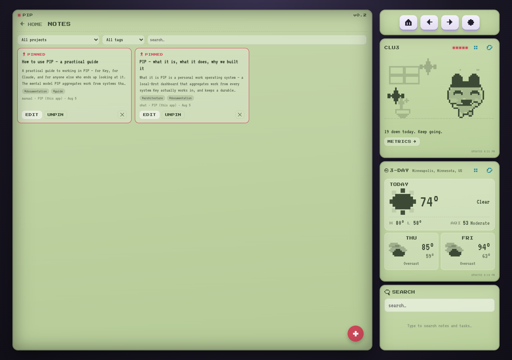

The Journal is deliberately **not** cards. It's written as the day goes and
reviewed in sequence, so entries stack chronologically with their full text
inline and a rule down the side that reads as a timeline.

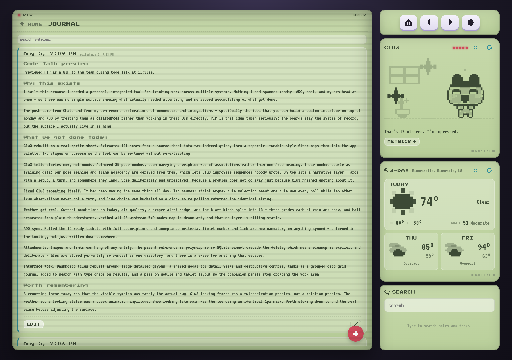

### Projects

A project ties everything together. Opening one shows its stakeholders,
links and images, and every related inbox item, task, note and journal entry —
each opening its own detail view. There's a filter for narrowing once you're
inside.

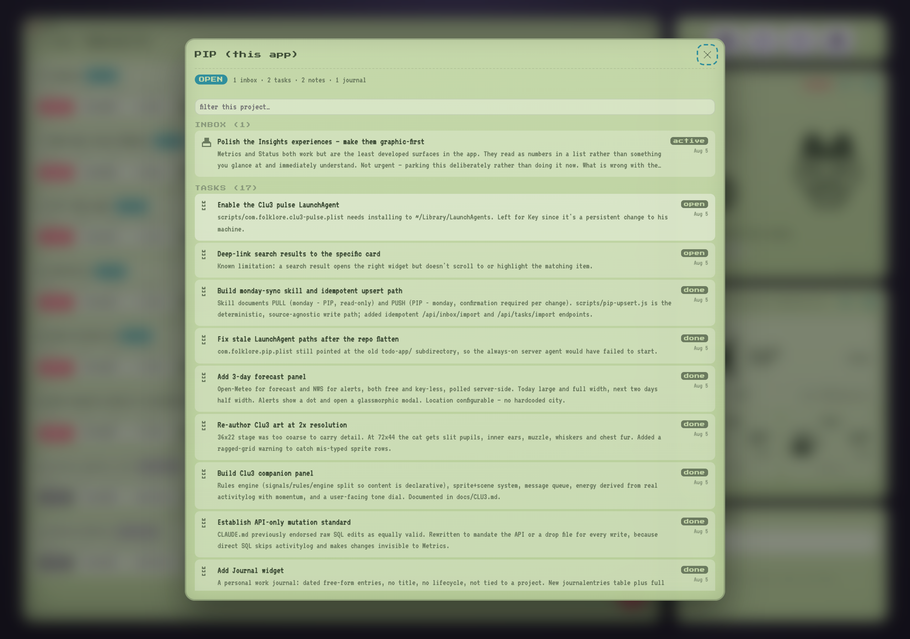

Closed projects sink to the bottom of the list and grey out entirely —
desaturated rather than merely faded, so finished work reads as finished at a
glance. That's still distinct from archived, which hides them: closing is a
statement about the work, not a wish to never see it again.

---

## Clu3

The companion in the top right. Not a chatbot — it reflects real workspace
state through a deterministic rules engine over real signals, with no LLM in
the render loop. If it looks alarmed, something actually is overdue.

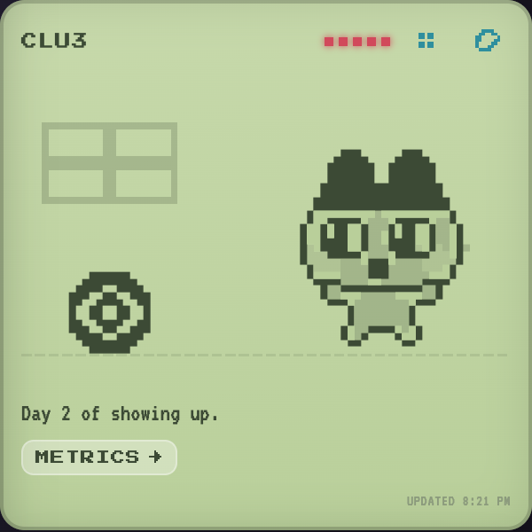

Clu3 performs from a **121-pose sprite sheet**. The pipeline is deliberately
two stages so it stays tunable: extraction produces raw indexed grids, and a
separate style filter maps them into the app's palette. The raw data is
committed, so the look can be re-tuned without re-extracting.

Every pose has a stable reference number. Clicking one shows every sequence it
appears in.

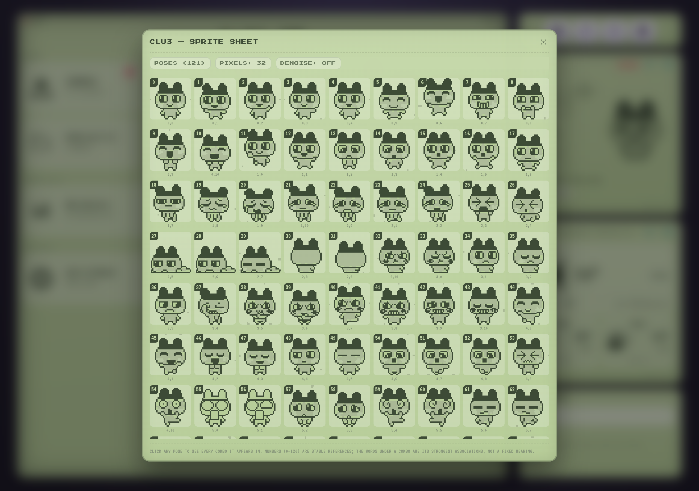

Meaning is a graph, not a lookup. 35 authored combos each carry a **weighted
web of associations** rather than one fixed label, so the same run reads
differently depending on context.

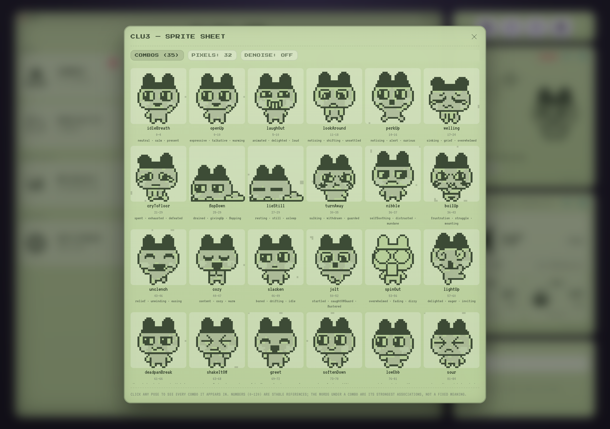

Those combos double as training data: per-pose meaning and frame adjacency are
*derived* from them, which lets Clu3 **improvise sequences nobody authored**.
Above that sits a narrative layer that shapes performances into arcs with a
setup, a turn, and a landing — some deliberately unresolved, because a problem
doesn't go away just because Clu3 finished emoting about it.

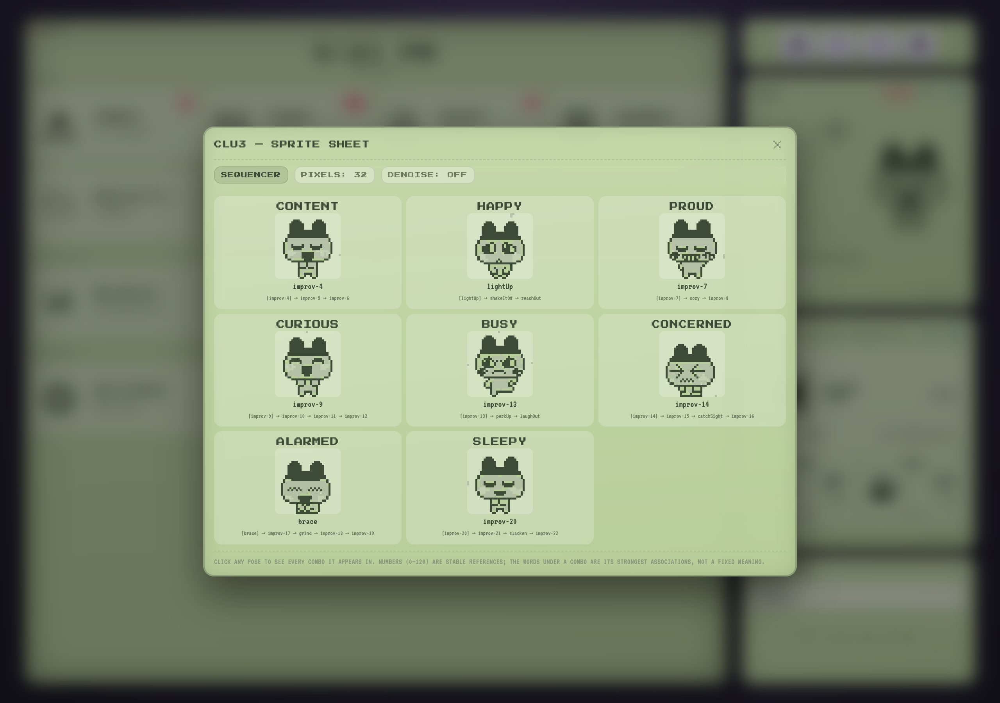

---

## Weather

Open-Meteo plus NWS alerts and air quality — all free, no API keys. Today
shows **current** conditions (distinct from the daily forecast), high/low, and
AQI. Active alerts get a counted badge.

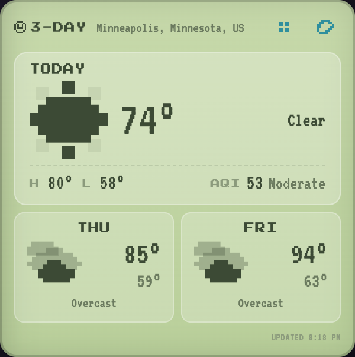

**13 drawn conditions** cover all 28 WMO codes the API can return — three
grades each of rain and snow, hail separate from thunderstorm. The preview
proves the mapping is complete and that no layer is sitting static.

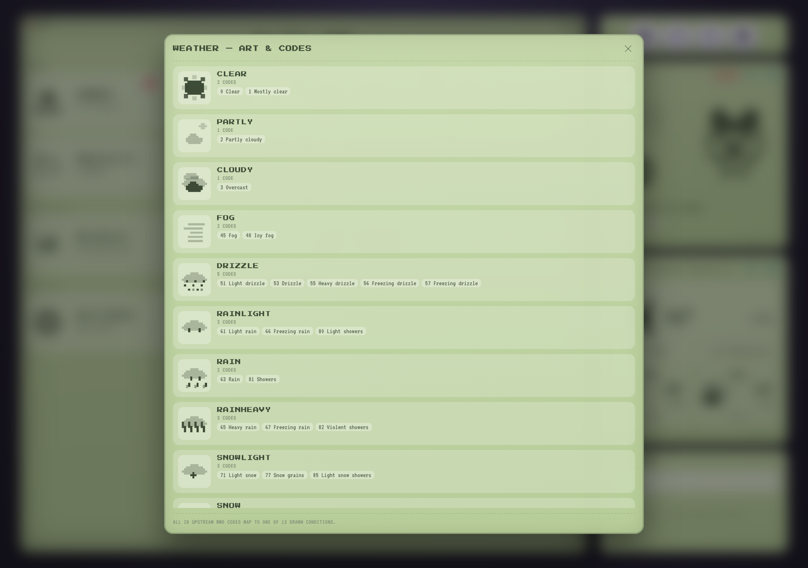

---

## Search

One box, covering Inbox, Tasks, Notes, Journal and tags. Results carry a type
chip — four entity types share one list, and a note and an inbox item are
otherwise indistinguishable by title alone. Clicking a result deep-links to
that exact card.

---

## Syncing

```
/ado-sync        pull assigned Azure DevOps work items
/monday-sync     pull monday items and mentions
```

Both **pull by default**. Pushing back is visible to colleagues and clients,
so it requires explicit per-change confirmation.

Every synced item carries its **ticket number and a link back** — enforced in
`scripts/pip-upsert.js`, which refuses records missing them, because a ticket
you can't navigate back to is a dead end. Upstream description and acceptance
criteria land in a separate field from your own notes, so a re-sync can never
overwrite what you wrote.

---

## Attachments

Images and links attach to any entity. Links carry a relationship
(design / testing / spec / source), so a ticket's design links are
first-class rather than buried in prose. Images can be uploaded or fetched;
anything behind auth — most monday and ADO attachments — degrades to a link
with the reason recorded rather than rendering broken.

The parent reference is polymorphic, so SQLite can't cascade the delete.
Cleanup is therefore explicit and deliberate: files are stored per-entity so
removal is one directory, every delete path calls `deleteForEntity()`, and
`sweepOrphans()` catches the rest.

---

## Sharing a static snapshot

```bash
npm run snapshot          # build -> ./snapshot
npm run snapshot:deploy   # build, then deploy to Netlify
```

Produces a serverless, read-only copy that runs anywhere — for handing someone
a link without standing up infrastructure. It's clearly labelled read-only,
and nothing in it can write back. The current one is live at
**[pip-workspace-snapshot.netlify.app](https://pip-workspace-snapshot.netlify.app)**;
re-run the command to refresh it.

It survives change because it doesn't reimplement the app: it runs the real
bundle and captures the real API's responses. Search is the exception — a
query can't be captured as a fixed response — so the snapshot ships the
server's own shaped search index and filters it in the browser.

---

## Responsive

The companion panels compact below desktop, because the work area is the point
of the screen. On tablet they share a row; on mobile they stack.

<p align="center">
  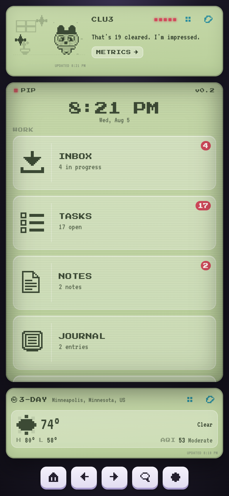
  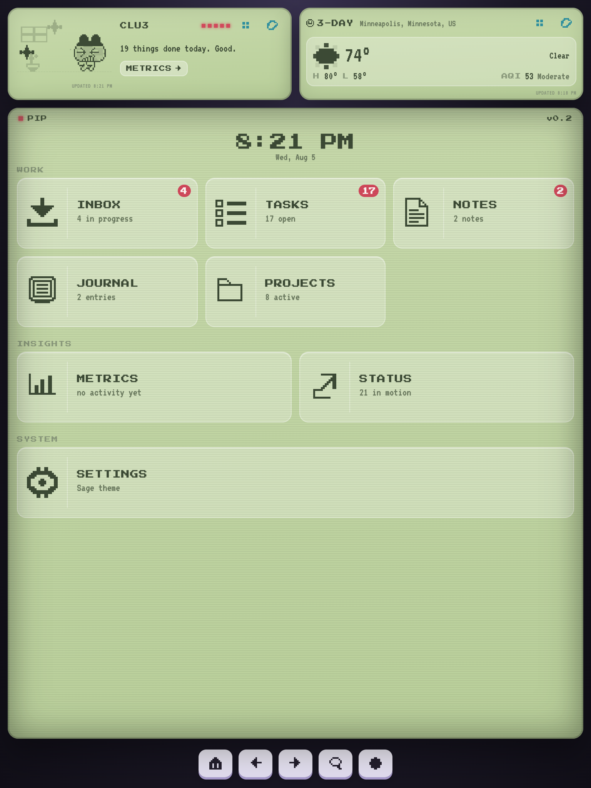
</p>

---

## Standards that keep the data trustworthy

- **Everything on screen is real.** No estimated, padded or placeholder
  numbers, anywhere. If something can't be known, it says so.
- **Every mutation goes through the API**, never raw SQL — that's the only
  path that writes `activity_log`, which Metrics is derived from.
- **Schema changes go through `MIGRATIONS`** in `server/schema.js`.
- **Destructive actions confirm first**, and say what is actually lost.
- **No emoji anywhere** — every glyph is hand-authored pixel art.

---

## Layout

```
server/            Express + better-sqlite3
  schema.js        the data model — tables, indexes, migrations
  repo/            one file per entity; the only layer touching SQL
  routes/          REST endpoints + events.js (SSE)
  clu3/            Clu3's signals, rules and decision engine
  weather/         Open-Meteo + NWS + air quality
src/
  api/             fetch client, mirrors server/repo. Static mode lives here.
  app/             shell, dashboard, modals, panels
  widgets/         one folder per widget
  lib/             dom helpers, pixel icons, sprite engine, Clu3's art + brain
scripts/           sync upsert, snapshot, screenshots
data/              pip.sqlite, drops/, attachments/  (tracked in git)
docs/              CLU3.md, CLAUDE-INTEGRATION.md, screens/
```

`docs/CLU3.md` covers the companion in depth. `docs/CLAUDE-INTEGRATION.md` is
for a Claude session without shell access to this machine.

---

## Known gaps

Tracked honestly rather than quietly:

- **Insights (Metrics, Status) need a graphic-first pass.** They're numbers in
  a list. Tracked as an inbox item.
- **No automated test suite.** Verification is by running the app and
  exercising it.
- **Attachments have no upload UI yet** — the API is complete and used, but
  adding one means the API or a drop file.
