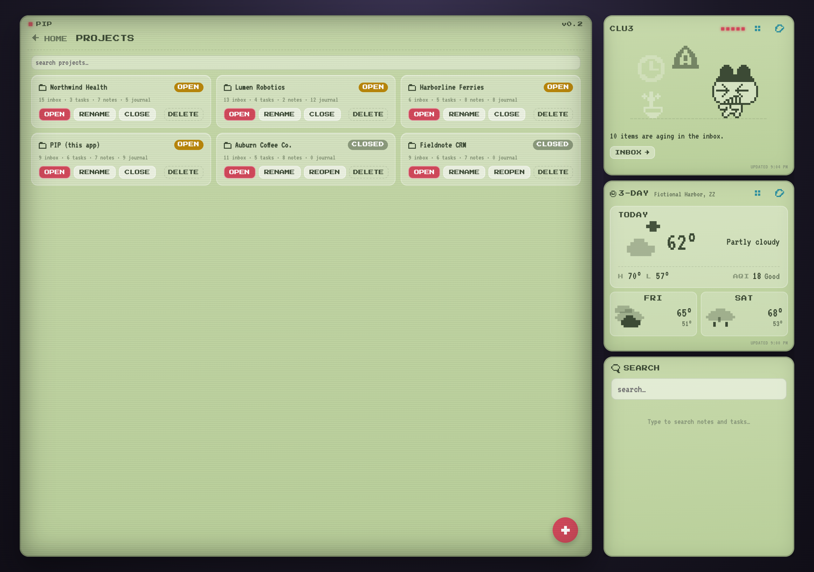
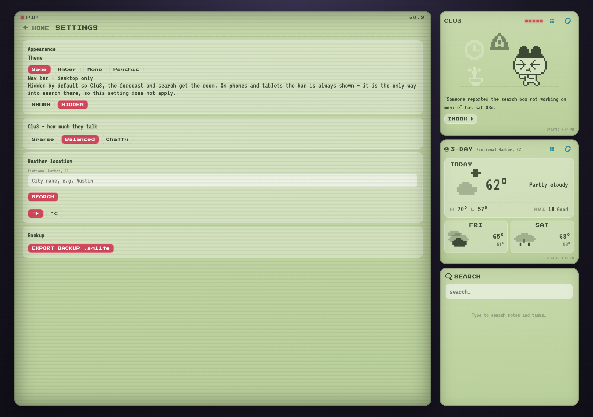

# PIP — a personal work operating system

A local-first dashboard that aggregates work from every system Key actually
works in, and keeps a durable record of what happened. Styled as a pixelated,
LED-lit device screen.

The underlying idea: treat **monday.com and Azure DevOps as datasources, not
as the interface**. They stay the system of record; the surface you actually
work in is this one.


**[Live demo →](https://pip-workspace-snapshot.netlify.app)**
A static build running three months of entirely fictional data — invented
clients, tickets, notes and metrics, generated to look like a real workspace
in daily use. Everything works — including search — but nothing saves, and a
banner says up top that none of it is real. No password: there's no real
client work in it to protect.

It's a real full-stack app — Express + better-sqlite3 on the backend, a
webpack-bundled frontend talking to it over `fetch()` and Server-Sent Events.
It replaced an earlier static/`file://`-only version specifically so Claude
could get direct, live access to the data.

If you're working on this with Claude Code, it reads `CLAUDE.md` automatically
— commands, architecture, conventions, and how it should interact with the
running app all live there. This README is the human-facing tour.

---

## Running it

```bash
npm install       # once — better-sqlite3 is a native addon
npm run server    # http://127.0.0.1:4288
```

Then either bookmark it, or install the LaunchAgent so it's always up:

```bash
cp scripts/com.folklore.pip.plist ~/Library/LaunchAgents/
launchctl load ~/Library/LaunchAgents/com.folklore.pip.plist
```

Frontend changes need `npm run build` (or `npm run watch`).

---

## The five entities

The distinction between them is the whole point.

| Entity       | What belongs here                         | Lifecycle                          |
| ------------ | ----------------------------------------- | ---------------------------------- |
| **Inbox**    | Anything needing triage                   | new → active → resolved → archived |
| **Tasks**    | Concrete work with a definition of done   | open → doing → done                |
| **Notes**    | Reference material, disconnected blurbs   | none                               |
| **Journal**  | A dated work log, written as the day goes | none — read in sequence            |
| **Projects** | What everything else can belong to        | open / closed                      |

If you're unsure between Notes and Journal: a **note** is something you'll go
looking for later; a **journal entry** is something you'll read in order.

### Tasks

Grouped the way you actually read a board — in progress, then queued, then
history. Done collapses by default because it's the biggest group and the
least actionable. Synced tickets lead with their number, linked back upstream.


Clicking a card opens the full ticket: upstream description, acceptance
criteria, metadata, images and links.


### Notes and Journal

Notes are cards with a clamped preview and a detail modal — they're
disconnected things you scan for one item.


The Journal is deliberately **not** cards. It's written as the day goes and
reviewed in sequence, so entries stack chronologically with their full text
inline and a rule down the side that reads as a timeline.


### Projects

A project is what ties everything else together — inbox items, tasks, notes
and journal entries can all belong to one.



Projects are **open** or **closed**. Closed ones sink to the bottom of the
list and grey out entirely — desaturated rather than merely faded, so finished
work reads as finished at a glance, while staying one click from reopening.
That's deliberately distinct from archiving, which hides a project outright:
closing is a statement about the work, not a wish to never see it again.

Opening one shows everything about it — stakeholders, links and images, and
every related item grouped by type, each opening its own detail view. There's
a filter for narrowing once you're inside.


That view reads from the project's own contents rather than the search index,
on purpose: search answers _what matches these words_, this answers _what
belongs here_, and a project whose items contain no matching text still has
its work.

---

## Clu3

The companion in the top right. Not a chatbot — it reflects real workspace
state through a deterministic rules engine over real signals, with no LLM in
the render loop. If it looks alarmed, something actually is overdue.


Clu3 performs from a **121-pose sprite sheet**. The pipeline is deliberately
two stages so it stays tunable: extraction produces raw indexed grids, and a
separate style filter maps them into the app's palette. The raw data is
committed, so the look can be re-tuned without re-extracting.

Every pose has a stable reference number. Clicking one shows every sequence it
appears in.


Meaning is a graph, not a lookup. 35 authored combos each carry a **weighted
web of associations** rather than one fixed label, so the same run reads
differently depending on context.


Those combos double as training data: per-pose meaning and frame adjacency are
_derived_ from them, which lets Clu3 **improvise sequences nobody authored**.
Above that sits a narrative layer that shapes performances into arcs with a
setup, a turn, and a landing — some deliberately unresolved, because a problem
doesn't go away just because Clu3 finished emoting about it.


---

## Weather

Open-Meteo plus NWS alerts and air quality — all free, no API keys. Today
shows **current** conditions (distinct from the daily forecast), high/low, and
AQI. Active alerts get a counted badge.


**13 drawn conditions** cover all 28 WMO codes the API can return — three
grades each of rain and snow, hail separate from thunderstorm. The preview
proves the mapping is complete and that no layer is sitting static.


---

## Settings

Theme, how much Clu3 talks, weather location and units, and a one-click
`.sqlite` backup export.



Two notes on what's here:

The **nav bar is hidden by default on desktop.** Those four buttons cost a
whole panel at the top of the right column, and everything they do is
reachable elsewhere — HOME from each view's own back button, back/forward from
the browser, theme from right here. The toggle is desktop-only and says so:
on phones and tablets that same bar is the bottom tab bar and holds the only
route into search, so it always stays.

**Clu3's tone** is a real dial, not decoration — `sparse` speaks only when
something matters, `chatty` keeps you company. It feeds the same rules engine
that decides what Clu3 says, by filtering which observations are allowed to
surface at all.

---

## Search

One box, covering Inbox, Tasks, Notes, Journal and tags. Results carry a type
chip — four entity types share one list, and a note and an inbox item are
otherwise indistinguishable by title alone. Clicking a result deep-links to
that exact card.

---

## Syncing

```
/ado-sync        pull assigned Azure DevOps work items
/monday-sync     pull monday items and mentions
```

Both **pull by default**. Pushing back is visible to colleagues and clients,
so it requires explicit per-change confirmation.

Every synced item carries its **ticket number and a link back** — enforced in
`scripts/pip-upsert.js`, which refuses records missing them, because a ticket
you can't navigate back to is a dead end. Upstream description and acceptance
criteria land in a separate field from your own notes, so a re-sync can never
overwrite what you wrote.

---

## Attachments

Images and links attach to any entity. Links carry a relationship
(design / testing / spec / source), so a ticket's design links are
first-class rather than buried in prose. Images can be uploaded or fetched;
anything behind auth — most monday and ADO attachments — degrades to a link
with the reason recorded rather than rendering broken.

The parent reference is polymorphic, so SQLite can't cascade the delete.
Cleanup is therefore explicit and deliberate: files are stored per-entity so
removal is one directory, every delete path calls `deleteForEntity()`, and
`sweepOrphans()` catches the rest.

---

## Sharing a static snapshot

Two flavors, both produced by the same underlying capture (`pip-snapshot.js`
runs the real bundle against a real server and freezes what the API returns —
see below):

```bash
npm run snapshot:demo     # seed fictional data -> capture it -> ./snapshot
npm run snapshot          # capture whatever server is on :4288 right now
npm run snapshot:deploy   # snapshot, then deploy to Netlify
```

**`snapshot:demo` is the one to hand someone outside the team.** It seeds a
throwaway database (`scripts/demo-data/index.js`) with three months of invented
work — fictional clients, tickets, people, notes, metrics — on a scratch port,
captures that, and tears the server down. It never opens the real
`data/pip.sqlite`, so there's no path by which real client work could end up
in the output; the safety is structural, not a matter of remembering to scrub
something. The served database has to identify itself as fictional
(`app_meta.demo_data`, checked by `/api/health`) before the snapshot will
proceed — the script refuses rather than silently publishing whatever happens
to be listening on the port. The result says so on screen: a banner across
the top, plus a Clu3 message on load.

**`npm run snapshot` captures whatever is actually running** — point it at the
real server for a genuine read-only mirror. Nothing about it distinguishes
real data from fake in the output, so it's on whoever runs it to know which
database is live at the time. This is the one worth putting a password in
front of (below); the demo has no need of one.

The current live link is the demo. It's live at
**[pip-workspace-snapshot.netlify.app](https://pip-workspace-snapshot.netlify.app)**;
re-run `npm run snapshot:demo` and redeploy to refresh it with a new three
months of invented history.

### Keeping the demo data current

`scripts/demo-data/` is a module, not a one-off script — it's organized as
one file per entity type (`seedProjects.js`, `seedTasks.js`, ...) plus shared
pieces (`rng.js`, `timeline.js`, `world.js`), because it gets touched every
time the data model changes or the demo needs new realism tuning, not just
once.

```bash
npm run demo:check   # is scripts/demo-data still current? no seeding needed
npm run seed:demo    # rebuild data/demo.sqlite in isolation, without deploying
```

The risk this guards against: a migration adds a table or column, every repo
call in `scripts/demo-data` keeps working without error, and the demo quietly
stops exercising whatever the change was for — nothing throws, so nothing
tells you. `demo:check` (`scripts/demo-data/freshnessCheck.js`) catches that
two ways: a **schema-version pin**, bumped only after actually reviewing a
migration against the seed modules, and a **table-coverage** scan that flags
any real table with zero rows in the seeded output. `snapshot:demo` runs both
automatically — once before seeding (fast, catches drift without spending
time on a seed run that's doomed anyway) and once after (catches a table the
seeder silently leaves empty) — and refuses to proceed if either fails.

### The gate

Set `PIP_SNAPSHOT_PASSWORD` in a local `.env` (gitignored — see
`.env.example`) and a real (non-demo) snapshot ships with a password screen in
front of the dashboard. Only a SHA-256 of the password is embedded, so the
plaintext never appears in the built output. `snapshot:demo` never gates,
regardless of that setting — there's no real client work in a demo for a
password to protect.

Be clear-eyed about what the gate is: **a deterrent, not access control.** The
check runs in the browser, and the captured JSON under `/api/` stays fetchable
directly by anyone who knows a URL. It stops a shared link opening straight
into someone's workspace; it does not protect the contents. Netlify's own
site-level password protection is the real answer if that matters for a real
snapshot.

The capture survives change because it doesn't reimplement the app: it runs
the real bundle and captures the real API's responses. Search is the
exception — a query can't be captured as a fixed response — so the snapshot
ships the server's own shaped search index and filters it in the browser.
Clu3's and the forecast's polling are switched off in a snapshot, since the
data is frozen by definition and re-fetching a captured file on a timer only
risks breaking the widget.

---

## Responsive

The companion panels compact below desktop, because the work area is the point
of the screen. On tablet they share a row; on mobile they stack.

<p align="center">
  
  
</p>

---

## Standards that keep the data trustworthy

- **Everything on screen is real.** No estimated, padded or placeholder
  numbers, anywhere. If something can't be known, it says so.
- **Every mutation goes through the API**, never raw SQL — that's the only
  path that writes `activity_log`, which Metrics is derived from.
- **Schema changes go through `MIGRATIONS`** in `server/schema.js`.
- **Destructive actions confirm first**, and say what is actually lost.
- **No emoji anywhere** — every glyph is hand-authored pixel art.

---

## Layout

```
server/            Express + better-sqlite3
  schema.js        the data model — tables, indexes, migrations
  repo/            one file per entity; the only layer touching SQL
  routes/          REST endpoints + events.js (SSE)
  clu3/            Clu3's signals, rules and decision engine
  weather/         Open-Meteo + NWS + air quality
src/
  api/             fetch client, mirrors server/repo. Static mode lives here.
  app/             shell, dashboard, modals, panels
  widgets/         one folder per widget
  lib/             dom helpers, pixel icons, sprite engine, Clu3's art + brain
scripts/           sync upsert, snapshot, screenshots
data/              pip.sqlite, drops/, attachments/  (tracked in git)
docs/              CLU3.md, CLAUDE-INTEGRATION.md, screens/
```

`docs/CLU3.md` covers the companion in depth. `docs/CLAUDE-INTEGRATION.md` is
for a Claude session without shell access to this machine.

---

## Known gaps

Tracked honestly rather than quietly:

- **Insights (Metrics, Status) need a graphic-first pass.** They're numbers in
  a list. Tracked as an inbox item.
- **No automated test suite.** Verification is by running the app and
  exercising it.
- **Attachments have no upload UI yet** — the API is complete and used, but
  adding one means the API or a drop file.
